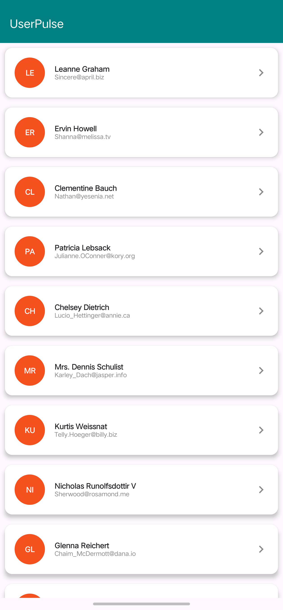
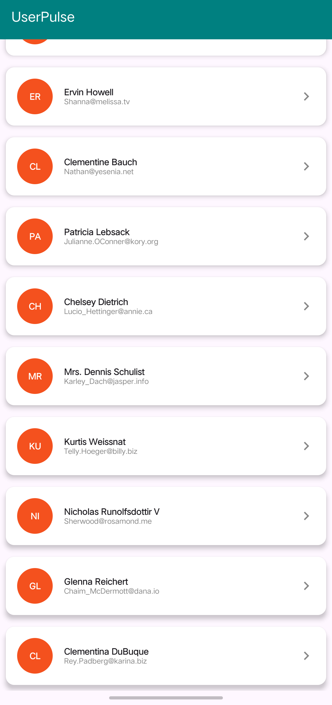
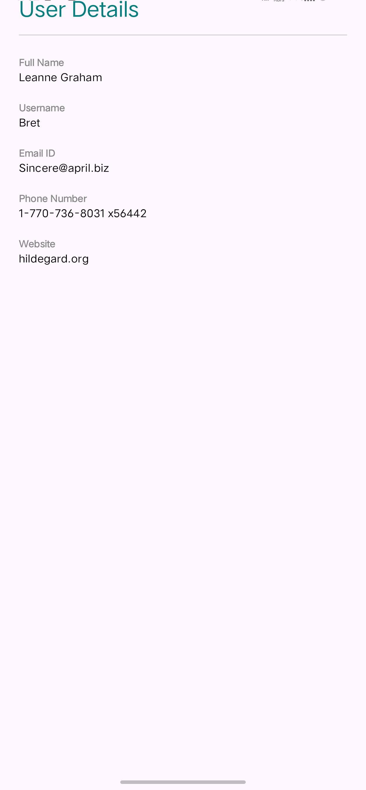
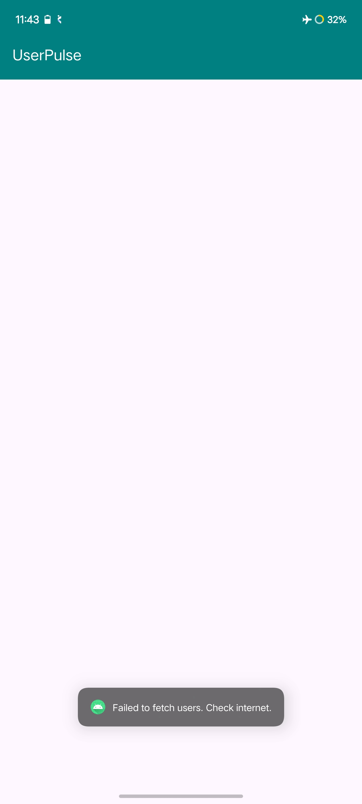

# UserPulse 

**UserPulse** is a modern Android application developed using **Kotlin** and **Jetpack Compose**. It fetches user data from a public API and presents it in a clean, interactive list. This project demonstrates the implementation of **MVVM Architecture**, **Retrofit** networking, and **Intent-based navigation**.

# Project Overview

The app is designed to fulfill the Android Developer Intern assignment requirements:
* **Architecture**: Follows **MVVM (Model-View-ViewModel)** principles for separation of concerns.
* **UI Framework**: Built entirely with **Jetpack Compose** (Material 3) for a modern, declarative UI.
* **Data Source**: Fetches real-time data from `jsonplaceholder.typicode.com/users`.
* **Navigation**: Uses explicit **Intents** to navigate from the User List to the Detail Screen.

 # Screenshots 
|  |
 |  |

# Tech Stack

* **Language**: Kotlin
* **UI Toolkit**: Jetpack Compose
* **Networking**: Retrofit 2 & Gson
* **Concurrency**: Kotlin Coroutines
* **State Management**: ViewModel & MutableState
* **Build System**: Gradle (Kotlin DSL)

# How to Run the App

Follow these steps to set up and run the project on your machine:

### 1. Prerequisites
* Install **Android Studio** (Ladybug, Koala, or newer version recommended).
* Ensure you have a stable internet connection for Gradle sync.

### 2. Setup
1.  **Clone/Download**: Download the project code to your computer.
2.  **Open in Android Studio**:
    * Launch Android Studio.
    * Select **File > Open** and choose the `UserPulse` folder.
3.  **Sync Gradle**:
    * Wait for the project to index and sync dependencies.
    * If prompted, click **"Sync Now"** in the top-right corner.

### 3. Running on Emulator
1.  Open the **Device Manager** in Android Studio.
2.  Create or select an Emulator (e.g., Pixel 7, API 34).
3.  **Important**: Ensure the emulator has internet access.
    * *Tip*: If images/data don't load, try **Wiping Data** of the emulator from Device Manager.
4.  Click the green **Run (▶)** button in the toolbar.

### 4. Running on Physical Device
1.  Enable **Developer Options** and **USB Debugging** on your Android phone.
2.  Connect your phone via USB.
3.  Select your device from the drop-down menu in Android Studio.
4.  Click **Run (▶)**.

---

# Testing the Features

* **Scroll**: Test the `LazyColumn` by scrolling through the list of 10 users.
* **Navigation**: Click on any user card (e.g., "Leanne Graham") to verify the Detail Screen opens with correct data.
* **Error Handling**: Turn off internet/Airplane mode and relaunch the app to verify the error Toast message.

# No internet Scenario
